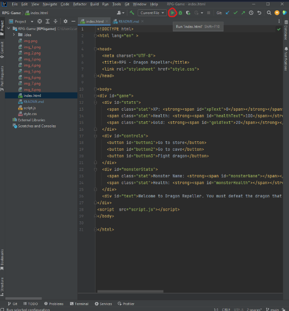
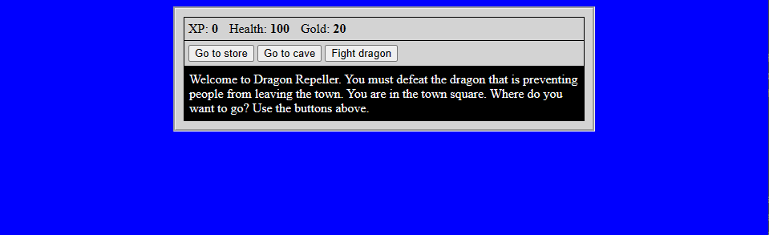

# RPG-Game
### This is just a mini RPG game I created using HTML, CSS, and JavaScript. You simply venture into a cave to fight as many monsters as you can, gaining XP along the way and assisting yourself with the valuables you can purchase in the store to prepare for the final battle against the mighty dragon.

Firstly, you must load up your IDE of choice, and run the HTML file on you local browser. 

You will be presented with the starting screen, the 'Town Square', to which you can go to the store, enter the cave to fight the monster of your choosing, or take on the dragon. 

If you select the 'Go to store' button you will once again be able to choose between gaining more health for 10 gold, gaining a new weapon for 30 gold, or going back to the town square.

If you select the 'Go to cave' option, you'll be able to the monster you wish to fight, either the weaker one with less reward 'Slime', or the stronger one with a greater reward 'Fanged Beast'.

When you choose a monster to fight you have three options, 'Attack' to deal a blow with your weapon to the monster, 'Dodge' to evade an attack from the monster, and 'Run' to go back to the 'Town Square'.

When you defeat a monster you gain XP and gold, and after a certain amount of experience has been gained possibly even health.

When you defeat a monster three 'Go to Town Square' buttons are displayed, and if you figure out which one is the easter egg, you'll gain access to the 'Pick a number' game for extra rewards.

Once you feel as if you're ready you can take on the mighty dragon as the final battle.

If you manage to defeat it, congrats you have beat the game! Feel free to play again.

If you are defeated, you lose and unfortunately will have to restart the game from scratch.

